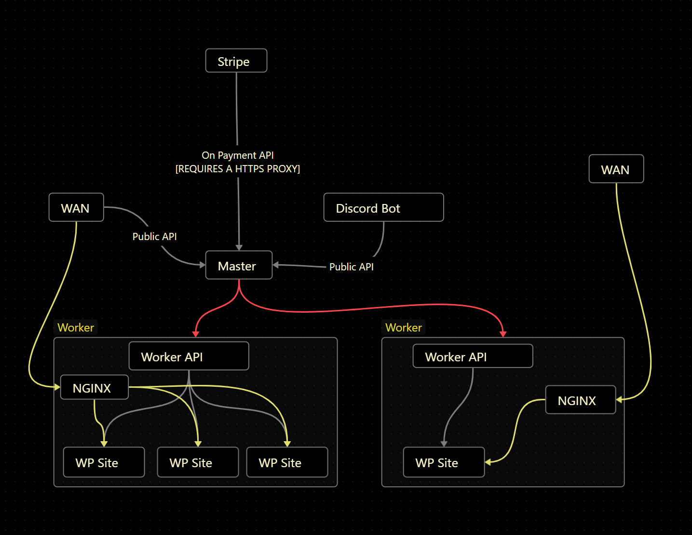

# HNSHosting Wordpress
This is split into two parts.
There is the master server which is the server that will be used to manage the worker servers.
Then there is the worker server which is the server that will be used to host the wordpress site.

This is done to make it easier to manage multiple wordpress sites on multiple servers.

## Overview

The master server will be used to manage the worker servers.
The worker servers will be used to host the wordpress sites.
The bot will be used to provide an easier way to manage the master server.

  

| Legend | Description |
| --- | --- |
| Red Connections | Secured by VPN or over LAN ONLY. (NOT API SECURED) |
| Yellow Connections | HTTP/HTTPS public traffic |


## Usage

After installing the master and discord bot you can use the following commands (as bot owner).

```
/addworker <ip> <private ip> <name> | add a worker to the master server pool
/listworkers                        | list all workers
/licence                            | Creates a licence key (valid for 1 wp site)
```

General commands (as anyone)

```
/createsite <domain> <licence key>  | Creates a wordpress site on a random worker server (uses up 1 licence key)
/siteinfo <domain>                  | Get info about a site (use after creating site to get TLSA and IP of the server)
```


## Master server install

Docker is the easiest way to install the master server.

```sh
docker run -d -p 5000:5000 -e LICENCE-API=your-api-key -e WORKER_KEY=your-api-key --name hnshosting-master git.woodburn.au/nathanwoodburn/hnshosting-master:latest -v ./data:/data
```
You can also mount a docker volume to /data to store the files instead of mounting a host directory.

Alternatively you can install it manually.
Set your .env file.
```sh
cd master
python3 -m pip install -r requirements.txt
```
Then to start the master api server
```sh
screen -dmS hnshosting-master python3 main.py
```

## Stripe webhook
Create a new webhook endpoint on stripe and set the url to https://master-server-domain:5000/stripe-webhook (note: you need to add a https proxy to your master server if you want to use stripe)
Add these environment variables to your master server
```yaml
STRIPE_SECRET: your-stripe-secret-key
STRIPE_ENDPOINT_SECRET: your-stripe-endpoint-secret
SMTP_HOST: smtp-server
SMTP_PORT: smtp-port
SMTP_USER: smtp-user
SMTP_PASS: smtp-pass
SMTP_FROM: smtp-from (eg. HNSHosting <hosting@nathan.woodburn.au>) This is optional
```


## Worker server install

Install prerequisites:

```sh
git clone https://git.woodburn.au/nathanwoodburn/hnshosting-wp.git
cd hnshosting-wp/worker
chmod +x install.sh
./install.sh
```
Just press enter when it shows any prompts.  

Start the worker api server using
```sh
screen -dmS hnshosting-worker python3 main.py
```

Add worker to master server pool:
The master server will need to be able to access port 5000 on the worker server over the PRIVATE ip. This is not secured by the api key so make sure you don't allow anyone else to access it.

```sh
curl -X POST http://master-server-ip:5000/add-worker?worker=worker-name&ip=worker-server-ip&priv=worker-server-private-ip -H "key: api-key"
```
Alternatively you can use the discord bot to add the worker to the master server pool.
```
/addworker <ip> <private ip> <name>
```

## Discord bot install

Docker install
```sh
docker run -d -e MASTER_IP=<MASTER SERVER IP> -e DISCORD_TOKEN=<YOUR-BOT-TOKEN> -e LICENCE_KEY=your-api-key -e WORKER_KEY=your-api-key --name hnshosting-bot git.woodburn.au/nathanwoodburn/hnshosting-bot:latest
```